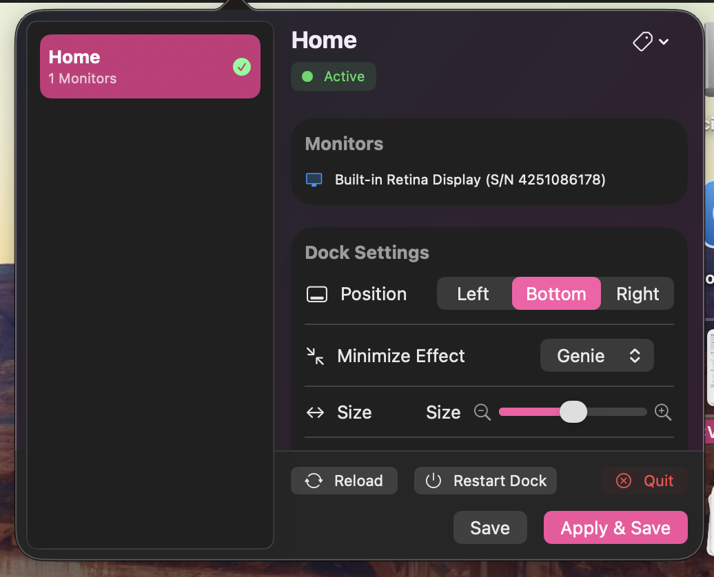

# Quick and Dirty Monitor Config Tool

Essentially, for each combination of monitors, we might want a unique Dock position and hiding behavior.

- Internal display only → hidden bottom dock
- External monitor → left dock that doesn’t hide

## Screenshot... WIP

## I got stuck....

So essentially we have to call some low level APIs sucj as killall-dock and that's just outright protected behind a dev account or SIP

I run into:

`killall: warning: kill -term 45438: Operation not permitted
Exit code: 1`

and cannot resolve it.  There's some very nasty chatgpt debug print-hell in `MacOSInterfaceUtils.swift` to try to get to the bottom of it.
