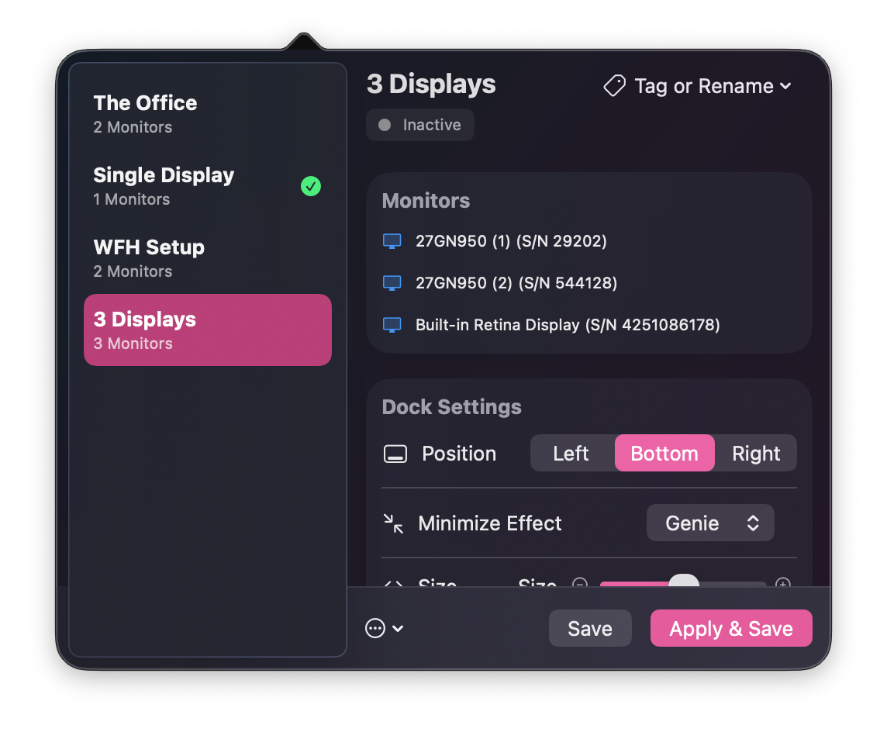
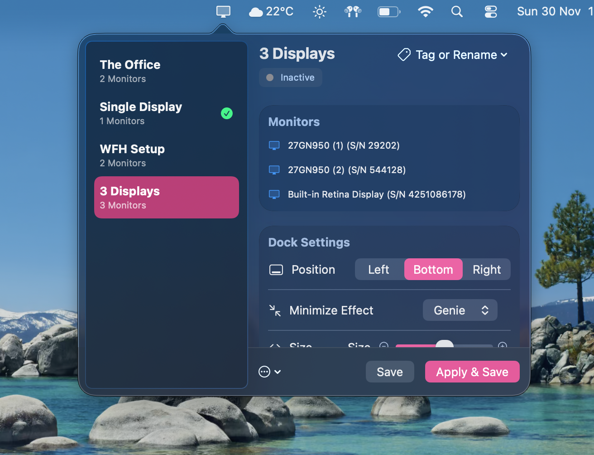

# Quick and Dirty Monitor Config Tool

**A utility for dynamic Dock configurations based on your connected monitor setup.**

Essentially, for each combination of monitors, we might want a unique Dock position and hiding behavior. This tool runs in the background and switches your settings automatically.

- **Internal display only** → Hidden bottom dock
- **External monitor** → Left dock that doesn’t hide

##  Downloads & Links

| Platform | Link |
| :--- | :--- |
| **Mac App Store** | [Coming Soon](/) |
| **Direct Download** | [Download .dmg](/) |
| **Website** | [Visit Live Website]( https://2of.github.io/QuickMonitorSettings/) |

## Features

* **Per-Monitor Profiles:** Assign specific Dock positions (Left, Bottom, Right) and visibility settings (Auto-hide On/Off) to specific display serial numbers or configurations.
* **Instant Switching:** Detects display changes immediately and applies the correct profile.
* **Lightweight:** Runs silently in the background with minimal resource usage.

## Code & Stack and Details

This repository contains the source code for the macOS application.

* **Language:** Swift
* **UI Framework:** SwiftUI / AppKit
* **System APIs:**
    * **CoreGraphics:** Used to detect display connect/disconnect events and identify monitor serial numbers -> We hasht these
    * **UserDefaults/Scripting:** Used to modify the Dock plist and restart the Dock process dynamically.

##  Screenshots

#### Feel free to use the 'open config folder' button to export json configs

##  License

This project is licensed under the MIT License - Do as you please but kindly send people my way